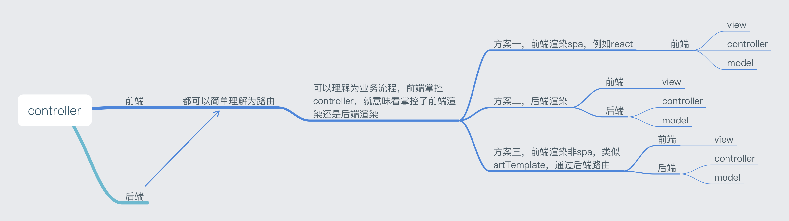

#### 1.什么是前后端分离
>    前后端都各自有自己的开发流程，构建工具，测试集合等等。后台只负责数据的提供和计算，而完全不处理展现。而前端则负责拿到数据，组织数据并展现的工作。这样结构清晰，关注点分离，前后端会变得相对独立并松耦合。
>    大家一致认同的前后端分离的例子就是SPA(Single-page application)，所有用到的展现数据都是后端通过异步接口(AJAX/JSONP)的方式提供的，前端只管展现。

#### 2.spa方案存在什么问题
    spa使用的是前端渲染
    在没有前端渲染之前，php/java进行的是后端渲染

#### 3.前端渲染与后端渲染的区别
1. 前端渲染
> 前端定位：发送请求、处理数据、渲染模板、处理流程
> 优点：
* 网络传输数据量小，节省带宽；  
* 不占用服务器资源（解析模板），减小服务器压力
* view层的调整、优化效率高，不需要服务器端介入
* controller层在前端，服务端不关心具体业务流程
> 缺点：
* 请求数量多，不符合减少请求数量的最优原则
* 耗时多，前端渲染最少也是两次请求，而后端渲染只需要一次请求
* 即使浏览器缓存了资源，依旧需要js执行一遍，才能渲染出页面。例如纯展示的静态页面，没有交互，当执行前进、后退、刷新的时候，性能会有很大差异

2. 后端渲染(前后端未分离的场景)
> 前端定位：切图、不关心渲染、不关心交互及流程
> 优点：
* 首屏渲染速度快，一次请求即可拿到全部内容
* 客户端可以cache，不用再次发送请求
* 开发速度快，不依赖前端，直接获取数据注入，方便快捷
>缺点：
* 前后端代码混在一起，难维护
* 占用服务器资源，渲染逻辑在服务器上
* controller层在后端：一套业务就要有一套流程，后端代码没有复用性
* 后端数据没有复用性，当对接的端不一致时，需要的数据大体一致，但表现跟流程又需要重写（PC端一套、移动端一套、pad一套）

#### 4.现有开发方案存在的问题
>    通过上边的分析可以发现，现有的spa并不满足真正的业务需求，两者都存在各种问题：
1. 纯粹的前端开发：速度慢、请求多...
2. 纯粹的后端开发：代码混乱、难以维护、一个人开发前后端...
------------
>   最合理的方案：前端渲染与后端渲染同时存在，并根据需求选择渲染方案：eg，
* 静态展示： 后端渲染
* 局部刷新： 前端渲染
* 静态展示包含局部刷新： 后端渲染包含前端渲染

#### 5.前端怎么做到后端渲染
    后端渲染等于服务器端渲染，所以就需要服务器。nodejs是前端人员的不二之选，学习成本低。

#### 6.前端有了服务器之后该做什么
> 首先，明确前后端职能
* 前端： view 处理视图展示
* 后端： model 处理数据逻辑

#### 7.contoller层是做什么的❓
前端跟后端都可以简单理解为路由，可以看做业务流程，既可以在前端也可以在后端。

#### 8.最终合理的分离模型
> 基于端对端模型实际的交流流程，在client跟sever之间添加了一个中间层node

#### 9.为什么要增加一层nodejs层呢？
> 传统的开发是后端驱动的，后端既要处理数据Model，又要处理路由Controller，无法专注开发
> node层的核心作用，是将controller层从server层迁移了出来

#### 10.增加node中间层之后的性能问题
* 缺点：可以看到node中间层的增加，实际上是增加了一层通信，性能损失在所难免，但是将前后端分离带来的开发效率的提升
* 优点：可以优化请求。
1. 假设我们的客户端需要访问6个接口才能拿到需要渲染的数据，在没有node的情况下，客户端发送6次请求给server。移动端建立http请求是很大的开销
2. 在有node做中间层的情况下，client发送6次请求给node，node整理6次请求给server，服务器端发送请求的速度要远超客户端，性能有保障
